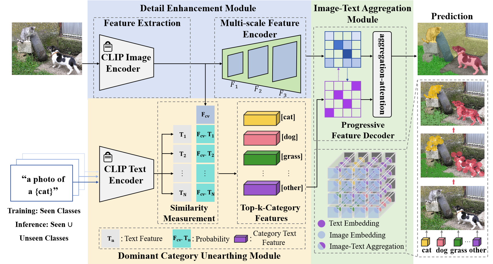

# Image-Text Aggregation for Open-Vocabulary Semantic Segmentation (ITA)

## Brief

Our method explores the potential of image-related text information. This paper proposes a novel open-vocabulary semantic segmentation method based on image-text aggregation (ITA). We design a dominant category unearthing module to mine text features strongly correlated with the image, facilitating the aggregation of image-text information. Additionally, we employ a detail enhancement module to mitigate the problem of losing image details. Moreover, our ITA accomplishes single-stage semantic segmentation via the image-text aggregation module. It outperforms the two-stage methods, which have the inherent challenges of inaccurate cropped image recognition and multiple forwarding, and thus demonstrates better performance and efficiency. Experimental results on multiple widely used benchmark datasets demonstrate that our ITA achieves excellent segmentation performance compared with the state-of-the-art open-vocabulary semantic segmentation methods.

## The Framework of the Proposed ITA
<table border=0 >
	<tbody>
    <tr>
		<tr>
			<td width="40%" >  </td>
		</tr>
	</tbody>
</table>


## Datasets
See [Preparing Datesets for ITA](dataset.md).
 ### Environment

See [installation instruction](INSTALL.md).

### CLIP

See [Preparing vision-language model](laionCLIP-convnext_large_d_320.laion2B-s29B-b131K-ft-soup/vision-language-model.md).

### Training/Resume Training

```python
# Use train_net.py to train the semantic segmentation task.
python train_net.py --num-gpus 8 --config-file configs/coco/semantic-segmentation/ita/ita_convnext_large_eval_ade20k.yaml
```

### Test/Evaluation

```python
# Evaluate our ITA
python train_net.py --config-file configs/coco/semantic-segmentation/ita/ita_convnext_large_eval_ade20k.yaml --eval-only MODEL.WEIGHTS /path/to/checkpoint_file
# Evaluate our ITA in other open-vocabulary semantic segmentation datasets.
ita_convnext_large_eval_ade20k.yaml 
# Replace to
ita_convnext_large_eval_ade20k.yaml
ita_convnext_large_eval_a847.yaml
ita_convnext_large_eval_pc59.yaml
ita_convnext_large_eval_pas20.yaml
ita_convnext_large_eval_pas21.yaml
```

## Acknowledgements

Our work is based on the following theoretical works:

- [Learning Transferable Visual Models From Natural Language Supervision](https://arxiv.org/abs/2103.00020)
- [Convolutions Die Hard: Open-Vocabulary Segmentation with Single Frozen Convolutional CLIP](https://arxiv.org/abs/2308.02487)
- [Masked-attention Mask Transformer for Universal Image Segmentation](https://arxiv.org/abs/2112.01527)

  ## Citation

If you find the code in this repository useful for your research consider citing it.

```
@article{Cheng2025ITA,
title={Image-Text Aggregation for Open-Vocabulary Semantic Segmentation},
journal = {IEEE Transactions on Circuits and Systems for Video Technology}​，
author={Shengyang Cheng, Jianyong Huang, Xiaodong Wang, Lei Huang, Zhiqiang Wei},
year={2025}
}
```

